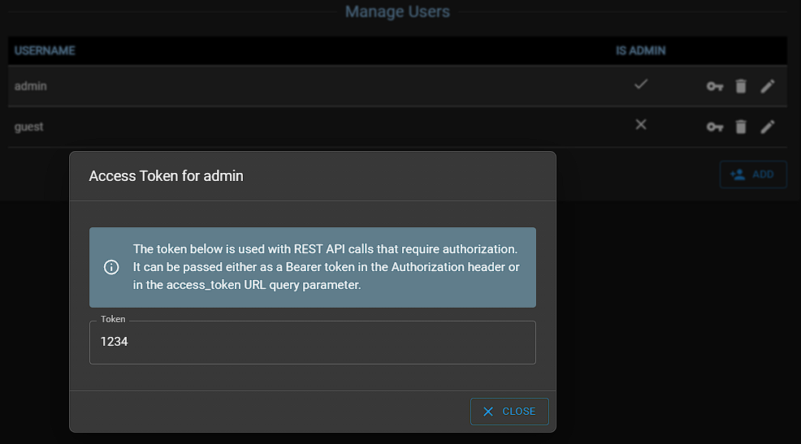
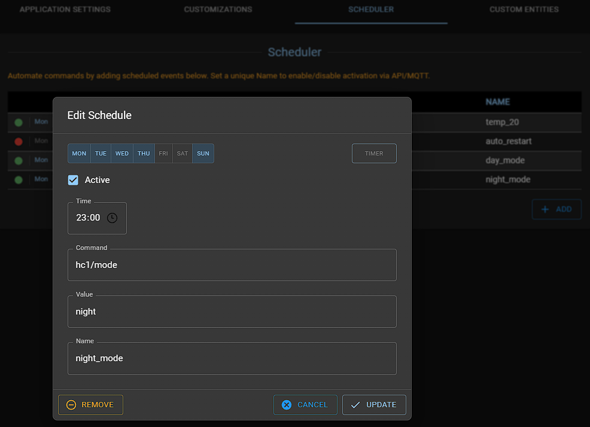
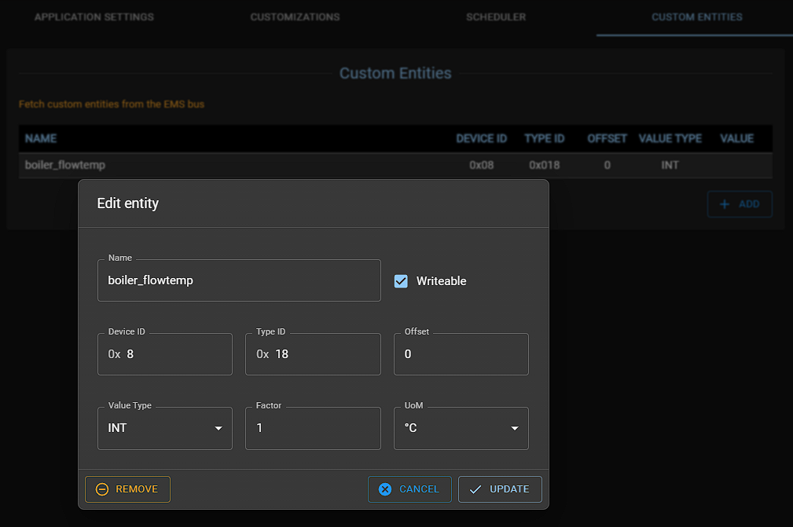

## Setting up for the first time

After uploading the firmware for the first time, it will use with the default settings and start an WiFi Access Point called `ems-esp`. Connect to this using the default WPA password `ems-esp-neo`. When prompted with a login screen (called a captive portal) sign-in with username `admin` and password `admin`.

Now you're ready to further configure the settings. The recommended first step is to connect to your home network and this can be configured through the Network menu option on the web page, or directly using a Telnet Command Line interface (CLI). If you haven't adjusted the hostname you can reach the web UI via <http://ems-esp> or <http://ems-esp.local>.

Next are the board settings and some other MQTT tweaking which you can read below.

If you're seeing warnings that it failed to connect to the EMS bus, or there are Tx or Rx errors then follow the [troubleshooting](Troubleshooting) guide.

!!! note "If Rx incomplete telegrams are reported in the log, don't panic. Some telegrams can be missed and this is usually caused by noise interference on the line."

## Application Settings

This next section describes some of key application settings that can be configured via the WebUI, found under the Settings menu.

### Board Profile

- If you have your own ESP32 development board you can choose from a pre-configured board (which is already set on a BBQKees Gateway) or select `Custom` to view and change the hardware settings:
  - **Rx GPIO** - Which GPIO pin the Rx is assigned to. By default this is GPIO 23 but it can be almost any free pin. Connect this GPIO pin to the RX port on the EMS interface board.
  - **Tx GPIO** - Which GPIO pin the Tx is assigned to. By default this is GPIO 5 but it can be almost any free pin. Connect this GPIO pin to the TX port on the EMS interface board.
  - **Button GPIO**. Set a pin with pull-up. The button is used for different functions, such as holding for 10 seconds to reset to factory settings.
  - **Temperature GPIO**. This is the pin where any external temperature sensors are attached. The Dallas chips DS1822, DS18S20, DS18B20, DS1825 are supported including their parasite varieties and can also be daisy-chained onto a single line, up to 100 sensors.
  - **LED GPIO**. This is the pin for the LED, defaulted to the onboard LED on the ESP dev board.
  - **Eth PHY Type** for choosing the Ethernet chip used.

!!! note "On ESP32 development boards there are often also pins marked RX and TX. However, these are usually connected to the USB chip and cannot be used for the EMS interface circuit."

### EMS Bus

- **Tx Mode**. Tx Mode is the mode in which EMS-ESP sends telegrams on the EMS bus. Choose the mode that works best for your system and watch for Tx errors in the Web Dashboard and `show ems` in the Console. Changing the value has immediate effect.
  - `EMS` is the default for EMS1.0 systems but also compatible with most other bus protocols.
  - `EMS+` is designed to work better for EMS2.0/EMS+ systems.
  - `HT3` for Heatronics3 used primarily by Junkers.
  - `Hardware` uses the internal ESP's hardware to send out the telegram. Telegrams are sent immediately. It is the fastest and most efficient method but works only on some systems.
- **Bus ID**. The EMS-ESP can simulate multiple devices. Stick to the `Service Key (0x0B)` unless using more than one EMS gateways/interface board.

### General Options

- **Hide LED**. Turns off the LED when in normal operating mode. The LED is still shown when booting or when there are connection issues.
- **Enable Telnet Console**. This is on by default and allows users to connect to the in-secure Telnet server on port 23.
- **Enable Analog Sensors**. This enables any GPIO to collect signals, whether it's a digital I/O, a pulse counter or ADC measuring mv.
- **Convert temperature values to Fahrenheit**. For our US friends.
- **Bypass Access Token authorization on API calls**. For RESTful write commands via HTTP POST the access token is required. This is for security reasons to prevent anyone changing device settings. Setting this flag makes the API open. Not recommended!
- **Enable Read only mode**. This disables any outgoing Tx write commands to the EMS bus, essentially putting EMS-ESP into listening mode.
- **Underclock CPU speed**. Under-clocks the ESP to 160Mhz, saving on power, heat and prolonging the lifespan of the chip at the cost of performance and response time. A reboot of EMS-ESP is required.
- **Enable Shower Timer**. Enable to time how long the hot water runs for and it will send out an MQTT message with the duration. The timer starts after a minimal of 2 minutes running time.
- **Enable Shower Alert**. This is somewhat experimental and may not work on all boilers. After 7 minutes (configurable) running the hot water it will send out a warning by sending cold water for 10 seconds (also configurable). The boiler goes into test mode to perform this operation so use with caution!

### Formatting Options

- **Boolean Format Dashboard**. This is how boolean values are displayed in the WebUI and MQTT payloads.
- **Boolean Format API/MQTT**. This is how boolean values are written in the MQTT payloads and API JSON output.
- **Enum Format API/MQTT**. This is how list values are presented in the MQTT payloads and API JSON, either by it's value or the index position within the list. Not if using Home Assitant you will not see the values but integer numbers for some entities, e.g. instead of `off, hot, cold` it will display `0, 1, 2`.

### Temperature Sensors

- **Enable parasite power**. Select this option when using (Dallas) temperature sensors with parasitic power.

### Logging to Syslog

- **Log EMS telegrams in hexadecimal** will write the telegrams in raw format as hexadecimal values everywhere.
- **Enable Syslog**:
  <!-- prettier-ignore -->
    - **IP** is the IP address of a syslog server for capturing remote logs. Leave blank is not using SysLog.
    - **Port** if using an alternate port number. The default is 514. And it uses UDP (not TCP).
    - **Log Level** sets the maximum log level for reported messages. The highest level is DEBUG which will send a lot of log data so use with caution.
    - **Mark Interval** will send out a special `mark` message to the SysLog. This is useful for timing events.

## Setting up MQTT

Most are self-explanatory and the settings that are specific to EMS-ESP are:

- **Broker Address**. Use the IP address.
- **Port**. The default is 1883 and 8883 for SSL.
- **Base**. All topics are prefixed with the `Base` so this is important. Make sure this is unique when using more than one EMS-ESP.
- **Client ID**. This is used internally to identify EMS-ESP with the broker and is optional. Note MQTT topics will be postfixed with the hostname (default `ems-esp`) and not the client ID. Use when having multiple devices.
- **Username** and **Password** are optional.
- **Set Clean Session**. Creates a non-persistent session when enabled. Default is disabled and is recommended to keep it disabled when using home automation systems.
- **QoS**. Quality of Service, 0, 1 or 2. 0 is the default and suitable for more scenarios. 1 will give a guarantee that the message has been sent, but will create slightly more traffic and overhead.
- **Always use Retain Flag**. Enable if you want to persist all the messages on the broker. Default is disabled.
- **Formatting**. The `As individual topics` option will send all data as separate topics, and `Nested` will group the data into one single JSON payload. The default is nested.
- **Publish command output to a 'response' topic'**. This takes the output from an API command (e.g. read) and publishes the result in a topic called `response`.
- **Publish single value topics on change**. This option will immediately publish the topic and payload for each operation and only available when MQTT Discovery is disabled.
- **Enable MQTT Discovery**. Enables the integration with Home Assistant and Domoticz.
  <!-- - prettier-ignore -->
      - **Entity ID format**: There are 3 options. The first `single instance, long names` uses the older < v3.5 format. The default and recommended setting for all new installs is the 2nd option called `Single instance, short name` which uses the EMS-ESP device entity name, which is fixed and can be seen in the `Settings->Customization` page. The last option must be used when running more than one version of the EMS-ESP firmware as it makes each unique by prefixing all MQTT topics with the base name.
- **Publish Intervals**. This section is per device and sets how frequent an MQTT message is sent. When set to 0 EMS-ESP will send data automatically when there is a noticeable change, which could be within a few seconds.

## Managing Users

The Security page allows you to change the default password for the captive portal and Telnet CLI. It also allows you to enable HTTPS for the captive portal and MQTT broker.

The Users page allows you to create additional users for the captive portal and Telnet CLI. The default user is `admin` with password `admin`.

Each user has an unique Access Token (viewable by clicking on the key icon) which is used for RESTful write commands via HTTP POST. This is for security reasons to prevent anyone changing device settings.

## Adding Analog and Temperature Sensors

External sensors, like temperature and analog sensors can be attached to a range of GPIO pins on the ESP32 chip. If using a BBQKees Gateway board it already has an external plug for Dallas temperature sensors which will be visible in the WebUI without any additional configuration.

To add analog sensors click on `Add Analog Sensor` and choose between a normal Digital in/out, a Counter (counting on/off pulses), ADC for measuring voltages, Timer, Rate and PWM 0-2. Note, the counter value is persisted and and not reset on reboot.

!!! warning

    Be careful when picking a GPIO so it doesn't clash with the other used GPIOs (you can select CUSTOM board profile to view your current configuration).

    EMS-ESP is connected to the low voltage bus of your heating and any over-voltage can damage the EMS-ESP board and possible your heating devices. Never power external equipment from the EMS-ESP board directly.

    ESP32 development boards vary in their available pin configuration. Typically you can't use 1, 6-11, 12, 14, 15, 20, 24, 28-31 and 40+. See these links [here](https://diyprojects.io/esp32-how-to-use-gpio-digital-io-arduino-code/#.YFpVEq9KhjG) and [here](https://nodemcu.readthedocs.io/en/dev-esp32/modules/gpio/).

The following GPIOs are recommended:

- digital output: `13, 19, 21, 22, 27, 33, 37, 38`
- digital input/counter/timer/rate: `13, 19, 21, 22, 25, 26, 27, 33, 35, 37, 38, 39 (note no pullup on 35 & 39)`
- ADC input: `13, 19, 21, 22, 25, 26, 27, 33, 35, 37, 38, 39`
- DAC output: `25, 26`
- PWM output: `13, 19, 21, 22, 25, 26, 27, 33, 37, 38`

Limits:

- ADC: `1.5V`
- DAC `8bit`
- PWM: `max frequency 5000Hz, resolution 13bits``
- Counter/timer/rate trigger: `high->low edge with 15 ms debounce. Only for low pulse rates.`

## Customizing Entities

The Customization page shows all registered entities and allows to exclude commands and values from publishing via mqtt/api or remove them from dashboard. The dashboard only shows entities with values, the customization page shows all. If an entity has no value then it is supported by EMS-ESP, but not by your boiler/thermostat/etc.

## Scheduling Actions

Use the scheduler to call commands at specific intervals. This is useful for example to set the hot water temperature to a higher value in the morning and evening, or do a system restart each week.

## Creating Custom Entities

If you know where specific data is hiding in a telegram you can sniff them out and create a custom entity. This is useful way to test for new values before we can extend officially in the firmware.

